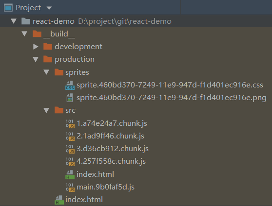

* [中文版](./README_CN.md)  
## Development Environment
* Operating system: window 10
* nodejs: 10.15.0
* npm: 6.9.0
* yarn: 1.9.2
* Development Tools: JetBrains WebStorm 2019.1.1 x64
* Browser: chrome 74.0.3729.131 stable

## Description
The self-contained framework is all implemented using ts code, including webpack and gulp package tool code, the summary is  
* Technical framework: `ts`+`yarn`+`wepack`+`gulp`+`react`+`redux`+`react-router`+`immutable`+`sass`  
* Hot load: feature uses `webpack-dev-server` as development service and implements hot loading  
* Prevent caching: js and sprites generated by the production environment are hashed, preventing the browser from retaining the cache before re-publishing the project.  
* Standardized sass: use `stylelint-scss` to standardize sass format in `.stylelintrc.json`  
* Standardized ts: Standardize ts code with `tslint-config-standard` in `tslint`  

## Running the project for the first time
Execute `yarn` in the project root directory

## Debugging
* `npm run devSprites`: Execute the packaged Sprite map, which runs every time you add a new image.
* `npm run devSrc`: Execute and compile index.html, do not have to run multiple times, test entity files only
* `npm run devServer`: Start webpack-dev-server, then open http://localhost:19080  


## Development
* `npm run sprites`: a sprite map of the production environment, a sprite file of the sprite, and a hash of the image file
* `npm run src`: package js of production environment, js files are hashed. Effect:



## Directory Description
* `config-ts/index.ts`: configuration of main webpack and gulp
* `config-ts/tsconfig-commom.json`: generic ts configuration

* `webpack-ts/webpack.server.config.ts`: Start the webpack-dev-server configuration file
* `webpack-ts/webpack.src.config.ts`: compile the actual file, separate development environment compilation and production environment compilation

* `webpack-ts/plugins/deleteFiles.ts`: empty files in a directory
* `webpack-ts/plugins/insterDataToHtml`: Insert the js generated by the webpack into the html file and insert the url of the sprite into the html file.

## Modify css-loader
This is to make it easy to locate the css file for editing in the browser.
Go to node_modules/css-loader/dist/index.js  
Comment out the following code  
```javascript
const moduleCode = `// Module\nexports.push([module.id, ${cssAsString}, ""${result.map ? `,${result.map}` : ''}]);\n\n `;
```

Add the following code to the corresponding  
```javascript
let map = null
if (result.map) {
  Map = result.map.toJSON()
  Map.sources = map.sources.map((src) => 'file:///' + src.replace(/\\/g,'/'))
}
const moduleCode = `// Module\nexports.push([module.id, ${cssAsString}, ""${result.map ? `,${JSON.stringify(map)}` : ''}]);\ n\n`;
```

Modify the location css by chrome, then modify the file, this modification will be saved locally  


## Other suggestion
1.css use BEM specification, see https://seesparkbox.com/foundry/bem_by_example  