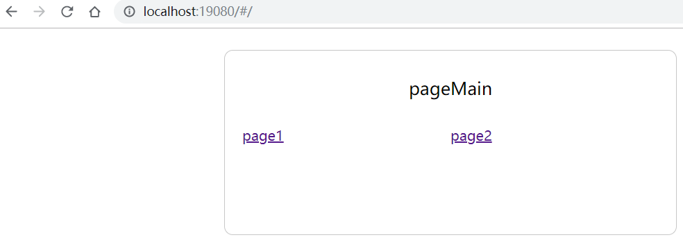
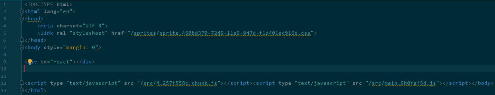

[中文版](./README_CN.md)

`react@16.8.6` + `redux@4.0.0` + `react-router@5.0.1` + `immutable@3.8.1` + +`webpack@4.20.2` + `typescript@3.0.3` + `sass` 

<!-- toc -->
- [Development Environment](#development-environment)
- [Feature](#feature)
- [Running the project for the first time](#running-the-project-for-the-first-time)
- [Debugging](#debugging)
- [Development](#development)
- [Directory Description](#directory-description)
- [Modify css-loader](#modify-css-loader)
- [Other suggestion](#other-suggestion)
<!-- tocstop -->

## Development Environment
- nodejs：10.15.0
- npm：6.9.0
- yarn：1.9.2
- vscode：1.36.1

## Feature
- immutablejs
- sass
- redux
- react-router
- code split
- hot load
- no cache
- stylelint
- tslint
- husky
- lint-staged

## Running the project for the first time
Execute `yarn` in the project root directory

## Debugging
- `npm run devSprites`: Execute the packaged Sprite map, which runs every time you add a new image.
- `npm run devSrc`: Execute and compile index.html, do not have to run multiple times, test entity files only
- `npm run devServer`: Start webpack-dev-server, then open http://localhost:19080  


## Development
- `npm run sprites`: a sprite map of the production environment, a sprite file of the sprite, and a hash of the image file
- `npm run src`: package js of production environment, js files are hashed. Effect:



## Directory Description
- `config-ts/index.ts`: configuration of main webpack and gulp
- `config-ts/tsconfig-commom.json`: generic ts configuration

- `webpack-ts/webpack.server.config.ts`: Start the webpack-dev-server configuration file
- `webpack-ts/webpack.src.config.ts`: compile the actual file, separate development environment compilation and production environment compilation

- `webpack-ts/plugins/deleteFiles.ts`: empty files in a directory
- `webpack-ts/plugins/insterDataToHtml`: Insert the js generated by the webpack into the html file and insert the url of the sprite into the html file.

## Modify css-loader
This is to make it easy to locate the css file for editing in the browser.
Go to node_modules/css-loader/dist/index.js  
Comment out the following code  
```javascript
const moduleCode = `// Module\nexports.push([module.id, ${cssAsString}, ""${result.map ? `,${result.map}` : ''}]);\n\n `;
```

Add the following code to the corresponding  
```javascript
let map = null
if (result.map) {
  map = result.map.toJSON()
  map.sources = map.sources.map((src) => 'file:///' + src.replace(/\\/g,'/'))
}
const moduleCode = `// Module\nexports.push([module.id, ${cssAsString}, ""${result.map ? `,${JSON.stringify(map)}` : ''}]);\n\n`;
```

Modify the location css by chrome, then modify the file, this modification will be saved locally  


## Other suggestion
1.css use BEM specification, [reference](https://seesparkbox.com/foundry/bem_by_example)