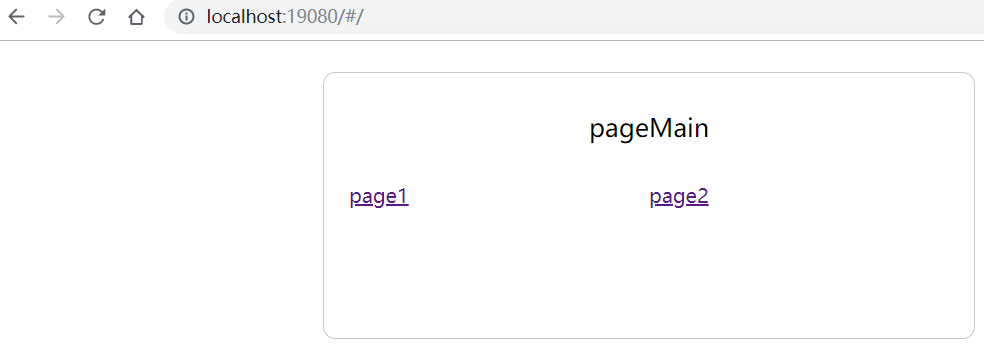
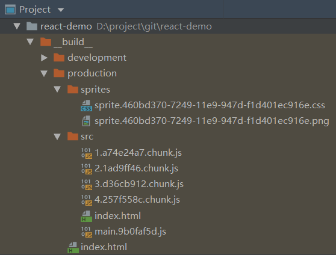
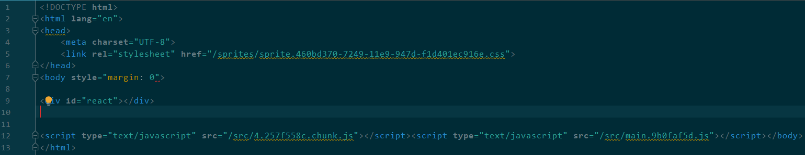
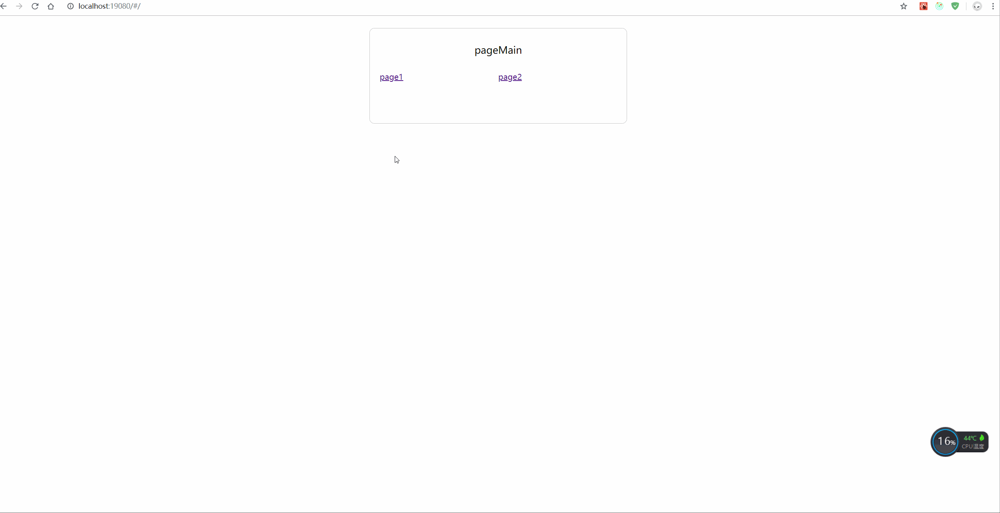

[English version](./README.md) 

<!-- toc -->
- [主要内容](#%e4%b8%bb%e8%a6%81%e5%86%85%e5%ae%b9)
- [开发环境](#%e5%bc%80%e5%8f%91%e7%8e%af%e5%a2%83)
- [markdown-toc](#markdown-toc)
- [特性](#%e7%89%b9%e6%80%a7)
- [第一次运行项目](#%e7%ac%ac%e4%b8%80%e6%ac%a1%e8%bf%90%e8%a1%8c%e9%a1%b9%e7%9b%ae)
- [调试](#%e8%b0%83%e8%af%95)
- [开发](#%e5%bc%80%e5%8f%91)
- [目录说明](#%e7%9b%ae%e5%bd%95%e8%af%b4%e6%98%8e)
- [修改css-loader](#%e4%bf%ae%e6%94%b9css-loader)
- [其他建议](#%e5%85%b6%e4%bb%96%e5%bb%ba%e8%ae%ae)
<!-- tocstop -->
 
## 主要内容
- `react@16.8.6` 
- `redux@4.0.0` 
- `react-router@5.0.1` 
- `immutable@3.8.1` 
- `webpack@4.20.2`
- `typescript@3.0.3` 
- `sass` 

## 开发环境
- nodejs：10.15.0
- npm：6.9.0
- yarn：1.9.2
- vscode：1.36.1

## [markdown-toc](https://github.com/jonschlinkert/markdown-toc)
- `npm install markdown-toc -g` or `yarn global add markdown-toc`
- `markdown-toc i README_CN.md`后可以自动在 `<!-- toc -->` 和 `<!-- tocstop -->`之间插入标题导航

## 特性
- immutablejs
- sass
- redux
- react-router
- code split
- hot load
- no cache
- stylelint
- tslint
- husky
- lint-staged

## 第一次运行项目
在项目根目录执行`yarn`

## 调试
- `npm run devSprites`：执行打包雪碧图，每次有加入新图片才运行
- `npm run devServer`：启动webpack-dev-server，然后打开 http://localhost:19080  


## 开发
- `npm run sprites`：打包生产环境的雪碧图，雪碧图css文件，图片文件带有hash
- `npm run src`：打包生产环境的js，js文件都带有hash。效果：  
  


## 目录说明
- `config-ts/index.ts`：主要webpack和gulp的配置
- `config-ts/tsconfig-commom.json`：通用的ts配置

- `webpack-ts/webpack.server.config.ts`：启动webpack-dev-server的配置文件
- `webpack-ts/webpack.src.config.ts`：编译出实际的文件，分开开发环境编译和生产环境编译

- `webpack-ts/plugins/deleteFiles.ts`：清空某个目录的文件
- `webpack-ts/plugins/insterDataToHtml`：插入webpack生成的js到html文件中，把雪碧图的url插入到html文件中

## 修改css-loader
说明这是为了方便定位css文件，以便在浏览器中修改  
进入node_modules/css-loader/dist/index.js  
注释掉如下代码  
```javascript
const moduleCode = `// Module\nexports.push([module.id, ${cssAsString}, ""${result.map ? `,${result.map}` : ''}]);\n\n`;
```

添加如下代码到对应的  
```javascript
let map = null
if (result.map) {
  map = result.map.toJSON()
  map.sources = map.sources.map((src) => 'file:///' + src.replace(/\\/g,'/'))
}
const moduleCode = `// Module\nexports.push([module.id, ${cssAsString}, ""${result.map ? `,${JSON.stringify(map)}` : ''}]);\n\n`;
```

通过chrome修改定位css，然后修改文件，这个修改会保存到本地  


## 其他建议
1.css使用BEM规范，[参考链接](https://seesparkbox.com/foundry/bem_by_example)